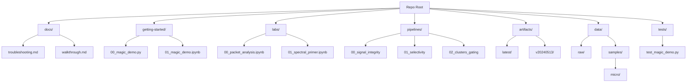

# Repository Map

## Directory Guide

### 🟢 Start Here
-   **`getting-started/`**: The entry point. Run the magic demo to see the engine in action.

### 🟡 Learn
-   **`labs/`**: Interactive notebooks to learn the concepts step-by-step.

### 🔴 Research
-   **`pipelines/`**: The core research suites. Use `pipelines/run_suite.py` or `make suite-<name>` to invoke (falls back to legacy scripts if present).

### 🔵 Resources
-   **`artifacts/`**: Validated outputs (cluster centroids, templates).
-   **`data/`**: The data library.
-   **`docs/`**: Manuals and specifications (see `troubleshooting.md` for common fixes).
-   **`tests/`**: Smoke tests (demo, pipelines once added).
